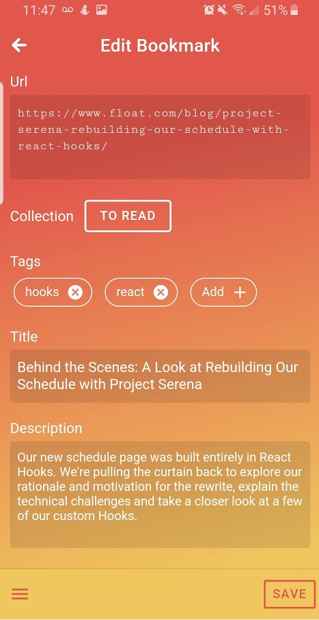

# Bookmarker

`Pinterest + Pocket = Bookmarker`

This app didn't need to be built, but I wanted a solution that was tailor fitted to me (and an excuse to experiment with some new technologies).

As a web developer I wanted:

- Something simple to help me save articles and videos for later consumption, similar to [Pocket](https://app.getpocket.com/) but without the special reading view (code snippets never show up right).
- Something to help me curate all the documentation, app/tools, and open source code I find useful. After describing this to my GF she rolled her eyes and said, "You mean [Pinterest](https://www.pinterest.com/)?"

## Installing Bookmarker

> **ATTENTION!!!** For now, the [Share Target](https://web.dev/web-share-target/) stuff ONLY works on **Android Chrome**.

Bookmarker is a Progressive Web App (PWA) you can install on your phone just by visiting the website.

1. Go to [https://bookmarker.site](https://bookmarker.site) on your mobile phone.
2. You will be prompted to add Bookmarker to your home screen. Do it.

Once added to the Home screen, the app will be "installed" and Bookmarker will become a "Share Target" on your phone. Now anytime you are reading an article you want to save for later, you can share it to Bookmarker.

## Using the Bookmarker

- When you add a new bookmark url, Bookmarker will automatically attempt to pull in the title, description, and image for that url
- You place bookmarks in a "Collection" (like a folder). These collections are what show on your home screen.
- You can tag your bookmarks, then click a tag to see all bookmarks with that tag
- Autotagging: Bookmarker will automatically apply any existing Tags it finds in a Title or Description.

## Maybe someday

1. Chome Extension so you can quickly bookmark links when on your computer.
2. Improve the search experience so it is easier to find the bookmark you are looking for.
